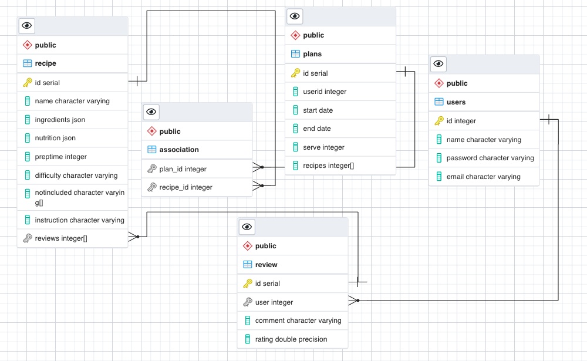

## ORM Design

This page describes the database schema.

## Tables

**users**

*table with users*

id: Integer PK

name: Varchar Not Null

password: Varchar Not Null

email: Varchar Not Null

**plans**

id: Integer PK

userid: FK Not Null

start: Date Not Null

end: Date Not Null

serve: Integer Not Null

recipes: Integer[] Not Null

**recipes**

id: Integer PK

name: Varchar Not Null

ingredients: JSON[] Not Null

nutrition: JSON[] Not Null

preptime: Integer Not Null

difficulty: Varchar Not Null

notincluded: Varchar[] Not Null

instruction: Varchar[] Not Null

reviews: Integer[] Not Null

**reviews**

id: Integer PK

user: Integer FK

comment: Varchar Not Null

rating: Double Precision Not Null
